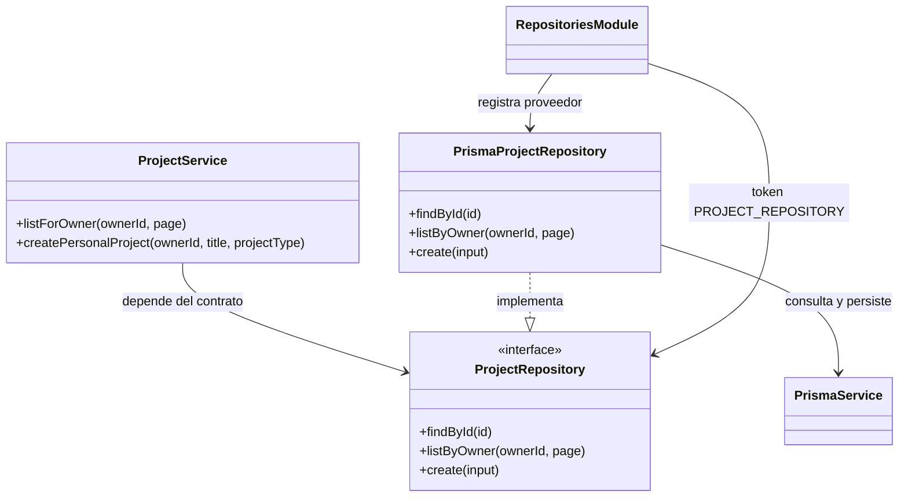

# Repository Pattern — APF2 hito 4

La persistencia se accede mediante contratos TypeScript, implementaciones Prisma y
tokens Symbol de NestJS. Los servicios dependen del contrato, no de PrismaService.
ProjectService demuestra la separación con consultas por propietario y creación de
proyectos personales; las pruebas inyectan otro repositorio sin conectar una BD.

## Componentes y alcance

| Contrato | Implementación | Operaciones del hito 4 |
|---|---|---|
| UserRepository | PrismaUserRepository | Buscar por ID (sin hash) y buscar credenciales por username |
| ProjectRepository | PrismaProjectRepository | Buscar por ID, listar por propietario y crear |
| WorkspaceRepository | PrismaWorkspaceRepository | Buscar por proyecto |
| ClassroomRepository | PrismaClassroomRepository | Listar por profesor |
| ProgressRepository | PrismaProgressRepository | Listar progreso por alumno |
| SimulationRunRepository | PrismaSimulationRunRepository | Listar ejecuciones por workspace |

No se implementa un CRUD genérico: cada contrato expresa operaciones necesarias del
dominio. Las escrituras restantes, servicios y endpoints se ampliarán en hitos 6–8.
No hay migraciones, modificaciones del seed ni endpoints nuevos en este hito.
Las clases de Prisma permanecen dentro de la capa de persistencia. Los contratos usan
tipos propios, fechas Date, JSON como strings del esquema actual y decimales como
strings exactos. La validación estructural del JSON corresponderá a los servicios.

## Diagrama de clases (ejemplo real de proyectos)



RepositoriesModule registra seis bindings token -> implementación y exporta los tokens.
ProjectsModule importa ese módulo y proporciona ProjectService; AppModule los incorpora.
Como las interfaces desaparecen al compilar TypeScript, @Inject(PROJECT_REPOSITORY)
resuelve el proveedor en tiempo de ejecución.

## Reglas y límites

- Las listas requieren propietario/profesor/alumno/workspace, con límite predeterminado
  de 25 y máximo de 100, offset entero y orden estable con desempate por ID.
- UserSummary excluye password_hash; findForAuthentication es exclusivamente interno
  para el hito de login. No devolver ese resultado desde un controlador.
- La creación de proyecto usa UUID de aplicación y campos explícitos, evitando que
  propiedades extra controlen ID o estado. ProjectService valida título/tipo.
- El repositorio no autoriza por sí solo: los servicios futuros deben verificar rol,
  matrícula y propietario antes de consultar o escribir. Un ID de filtro no constituye
  autorización. No se expone un endpoint de proyectos hasta implementar esa capa.
- Los errores de Prisma se propagan internamente; el manejo de conflictos/no encontrado
  y su traducción HTTP se implementará con las APIs del hito 6.
- El módulo de health conserva su consulta directa como comprobación técnica de BD,
  sin lógica de negocio ni repositorio de dominio.

## Pruebas locales en Windows

Detener el backend anterior con Ctrl+C antes de reiniciarlo. Primero actualizar:

```powershell
cd C:\Users\franc\Escritorio\ProyectoIntegrador2
git pull origin main
cd Backend
npm ci
npm run prisma:generate
npm run build
npm test
npm run test:repositories:db
npm run prisma:status
npm run start:dev
```

Mantener Backend/.env que ya funciona. No volver a ejecutar baseline ni importar SQL.
La prueba test:repositories:db inicia el contexto NestJS, resuelve los seis tokens y
consulta cada tabla a través de su repositorio. Usa un UUID reservado como filtro;
respuestas vacías son válidas. No escribe, no exige usuarios de prueba y no imprime datos
personales. Demuestra wiring y lecturas reales, no CRUD ni permisos de usuario.
Se esperan seis mensajes PASS y un resumen PASS. Detenerse si aparece FAIL.

En otra ventana:

```powershell
Invoke-RestMethod http://127.0.0.1:3000/health
```

Esperado: status ok / database up. Adjuntar salidas de npm test, test:repositories:db,
prisma:status y health. Los tests automáticos con dobles prueban separación del servicio,
límites, filtros, proyección sin hash, campos permitidos, UUID y precisión decimal.
Las pruebas de escrituras reales y permisos se realizarán en hitos posteriores.

## Evidencia disponible

Hito 3 validado por el usuario en MySQL 8.0.39 el 9 de octubre de 2026:
introspección, baseline 0_init aplicado, estado actualizado, inicio NestJS y /health ok/up.
La validación de estos repositorios contra ese servidor y MariaDB queda pendiente.
En hito 4 se reportaron 12 alertas npm. El estado actualizado de dependencias y auditoría
se documenta en AUTENTICACION.md para hito 5.

## Extensión de autenticación (hito 5)

UserRepository incorpora findCredentialsById para verificación interna de sesiones y
updatePassword con comparación del hash anterior y estado activo en una actualización
atómica. Solo las consultas explícitas de credenciales incluyen el hash; la API usa una
proyección pública. Con AuthModule, el contexto de smoke requiere JWT_SECRET válido en .env.


## Operaciones funcionales (hito 6)

LearningRepository agrupa operaciones coordinadas entre alumnos, consentimiento, matrícula,
catálogo, proyectos, workspace/versiones y progreso. Se mantienen los seis repositorios
anteriores; el nuevo contrato no importa Prisma/NestJS. PrismaLearningRepository implementa
transacciones para consentimiento/estado, matrículas, CAS/snapshots y progreso monotónico.
LearningService aplica autorización por recurso y calcula datos derivados; el controlador
solo expone DTO validados y el actor de JWT. Ver APIS_HITO6.md para contrato y pruebas.
