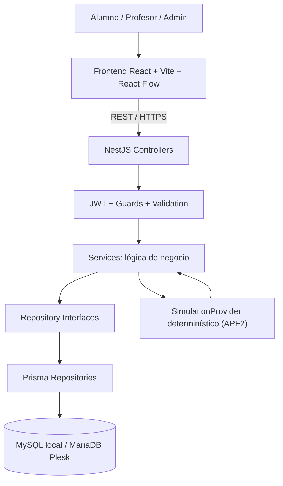

# Arquitectura de AI Blocks Studio — APF2

## Alcance y principio

Esta es la **arquitectura objetivo**, no una afirmación de que el backend, MySQL o el despliegue ya funcionen. Para APF2 se completa una primera versión vertical: login por roles, información persistida, edición de bloques, guardado de un workspace y resultado de entrenamiento pedagógico básico.

Se conserva el frontend existente en React/Vite/React Flow. El usuario opera desde el navegador, que consume una API NestJS mediante HTTPS. Ningún usuario se conecta a la base directamente.

## Diagrama



### Desarrollo local

- **Frontend**: `localhost:5173`.
- **Backend**: `localhost:3000` (se implementará en el hito 3).
- **Base**: MySQL existente en `127.0.0.1:3306`, base `aiblockstudio`.
- **Alternativa de pruebas**: contenedor MariaDB optativo en `127.0.0.1:3307`, exclusivamente si se habilita el perfil `db-container` de Docker Compose.

### Despliegue objetivo

- **Frontend**: archivos estáticos compilados por Vite publicados en Plesk.
- **Backend**: proceso Node.js de NestJS bajo Plesk, si el proveedor habilita la extensión Node.js y soporta la versión requerida.
- **BD**: MariaDB en Plesk, accesible únicamente por el backend.
- **TLS**: HTTPS obligatorio, dominios y CORS restringidos; secretos como variables del entorno de producción.

Antes de desplegar se verificará la **versión exacta de MariaDB y Node.js disponible en Plesk**, así como la compatibilidad de Prisma y del SQL. No se asume paridad automática MySQL/MariaDB: se evitarán funciones SQL exclusivas de un motor y se probarán todas las migraciones y consultas en el destino.

## Capas del backend

1. **Controllers**: contratos HTTP, autenticación y respuestas.
2. **Services**: reglas de negocio y autorización sobre recursos.
3. **Repository interfaces**: abstracción de acceso a datos exigida por la rúbrica.
4. **Prisma repositories**: implementaciones sobre MySQL/MariaDB.
5. **Persistencia**: tablas relacionales, llaves, relaciones, restricciones e índices.

Prisma utilizará el conector `mysql` para ambos motores. Se diseñará un `database/schema.sql` verificable contra el modelo físico y las migraciones implementadas en el hito 2.

## Dominio mínimo de APF2 (diseño pendiente del hito 2)

Usuarios y roles, niveles, salones y membresías, proyectos, workspaces con grafo de bloques serializado como JSON, progreso y ejecuciones pedagógicas, auditoría. Nombres de tablas, tipos exactos y claves serán fijados en el modelo físico del hito 2; esta sección no pretende ser un DDL definitivo.

## Contrato conceptual del editor (se conserva)

```json
{
  "version": 1,
  "nodes": [
    { "id": "dataset-1", "type": "dataset", "config": {} },
    { "id": "resize-1", "type": "resize", "config": { "width": 224, "height": 224 } },
    { "id": "cnn-1", "type": "cnn", "config": { "filters": [32, 64] } }
  ],
  "edges": [
    { "source": "dataset-1", "target": "resize-1" },
    { "source": "resize-1", "target": "cnn-1" }
  ]
}
```

El JSON deberá validarse del lado del servidor, y su tipo de columna será decidido considerando diferencias entre MySQL y MariaDB.

## Límites y evolución

- **Dentro de APF2**: versión determinista del entrenamiento pedagógico, persistencia de sus resultados y un flujo demostrable de usuario/profesor.
- **Fuera de APF2 por ahora**: entrenamiento real con GPU, PyTorch/TensorFlow, Redis para jobs, MinIO para artefactos y el currículo completo de 24 semanas. No se eliminan estos conceptos del roadmap de producto; se posponen para reducir riesgos académicos y operativos.
- **Replicación**: no se afirma replicación configurada. El informe del hito 10 describirá estrategia, respaldo, recuperación y los recursos concretos que permita el hosting Plesk.
- **Autorización**: como MariaDB no implementa las políticas RLS de Supabase, la validación de propiedad de los recursos debe realizarse de forma sistemática en los servicios/consultas del backend.
